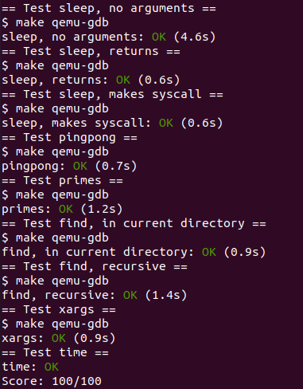
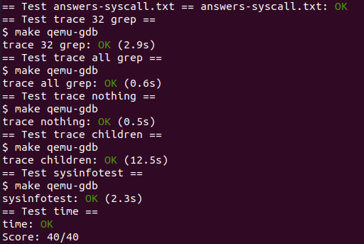
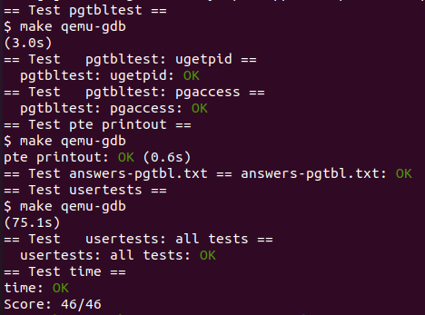
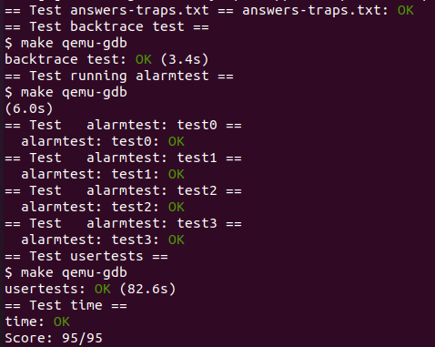
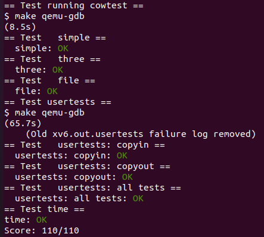
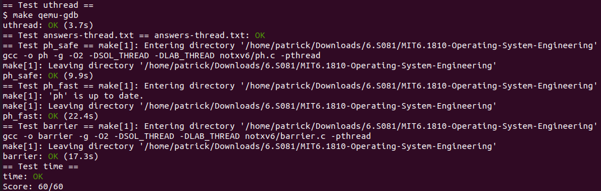
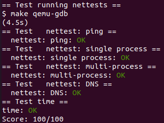
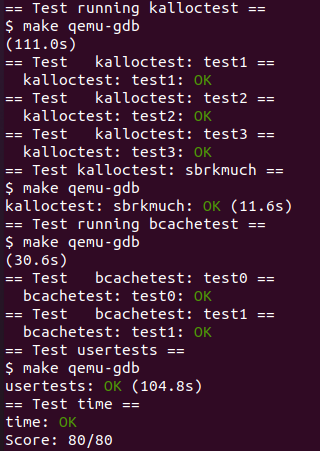
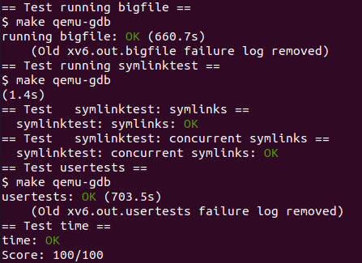
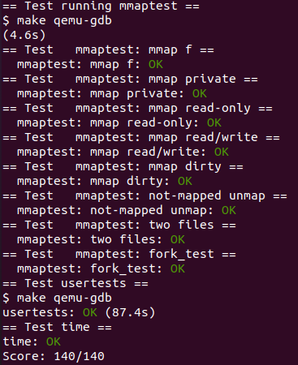

# MIT S6.1810

I always wanna get a hand-on experience on kernel programming. MIT S6.1810 has always been recommended as one of the best OS courses.
It has been written on my to-do list for so long and finally in this winter vacation, I got time to do its lab.

## courses link
[MIT S6.1810](https://pdos.csail.mit.edu/6.828/2022/index.html)

## labs
This modules contains 10 labs, which basically cover all aspects of an OS (incl. syscall, file system, process scheduling, etc.).
I strongly recommend to read all corresponding materials listed in the labs. And actually, the things you learnt by reading will be much more than you just do these labs directly.
These materials explain not only the implementaions in a high-level way, but also the details of codes.
After finishing all the labs, I just find out that kernel or OS are not black magic, they are just normal software but organized in a well-desgined way.
However, at the same time, I was shocked by the genius desgin in the OS (like the way doing process switch).
I just realize there is a long way to go for me to study computer science more throughtly.

### labs result:

Basically I just passed and get full marks of all the `make grade` tests. However, the `make grade` labs might failed occasionall. Also, I did these labs on my virtual machines on my WIN 10 pc. My machine was quite old and its computing power might be not that strong, so for some labs, I modified the test time to allow my computer finishing the test. For lab 10 (mmap), it was quite complicated than my expectation, thus I did not reserve that much time to do it. So in lab 10, my codes was quite rude and straight-forward. Also, I might omit some potential bugs. Nevertheless, I still got full marks of that test. 
If you find any bugs, please feel free to remind me or fix them, I would be very grateful 😁.

1. utilities

2. system calls

3. page tables

4. traps

5. copy-on write

6. multithreading

7. network driver

8. lock

9. file system

10. mmap

Most importantly, I really hope my codes can help you or at least give you some hints for your programming.

## Original README

xv6 is a re-implementation of Dennis Ritchie's and Ken Thompson's Unix
Version 6 (v6).  xv6 loosely follows the structure and style of v6,
but is implemented for a modern RISC-V multiprocessor using ANSI C.

ACKNOWLEDGMENTS

xv6 is inspired by John Lions's Commentary on UNIX 6th Edition (Peer
to Peer Communications; ISBN: 1-57398-013-7; 1st edition (June 14,
2000)).  See also https://pdos.csail.mit.edu/6.828/, which provides
pointers to on-line resources for v6.

The following people have made contributions: Russ Cox (context switching,
locking), Cliff Frey (MP), Xiao Yu (MP), Nickolai Zeldovich, and Austin
Clements.

We are also grateful for the bug reports and patches contributed by
Takahiro Aoyagi, Silas Boyd-Wickizer, Anton Burtsev, Ian Chen, Dan
Cross, Cody Cutler, Mike CAT, Tej Chajed, Asami Doi, eyalz800, Nelson
Elhage, Saar Ettinger, Alice Ferrazzi, Nathaniel Filardo, flespark,
Peter Froehlich, Yakir Goaron, Shivam Handa, Matt Harvey, Bryan Henry,
jaichenhengjie, Jim Huang, Matúš Jókay, Alexander Kapshuk, Anders
Kaseorg, kehao95, Wolfgang Keller, Jungwoo Kim, Jonathan Kimmitt,
Eddie Kohler, Vadim Kolontsov, Austin Liew, l0stman, Pavan
Maddamsetti, Imbar Marinescu, Yandong Mao, Matan Shabtay, Hitoshi
Mitake, Carmi Merimovich, Mark Morrissey, mtasm, Joel Nider,
OptimisticSide, Greg Price, Jude Rich, Ayan Shafqat, Eldar Sehayek,
Yongming Shen, Fumiya Shigemitsu, Cam Tenny, tyfkda, Warren Toomey,
Stephen Tu, Rafael Ubal, Amane Uehara, Pablo Ventura, Xi Wang, Keiichi
Watanabe, Nicolas Wolovick, wxdao, Grant Wu, Jindong Zhang, Icenowy
Zheng, ZhUyU1997, and Zou Chang Wei.

The code in the files that constitute xv6 is
Copyright 2006-2020 Frans Kaashoek, Robert Morris, and Russ Cox.

ERROR REPORTS

Please send errors and suggestions to Frans Kaashoek and Robert Morris
(kaashoek,rtm@mit.edu).  The main purpose of xv6 is as a teaching
operating system for MIT's 6.S081, so we are more interested in
simplifications and clarifications than new features.

BUILDING AND RUNNING XV6

You will need a RISC-V "newlib" tool chain from
https://github.com/riscv/riscv-gnu-toolchain, and qemu compiled for
riscv64-softmmu.  Once they are installed, and in your shell
search path, you can run "make qemu".
